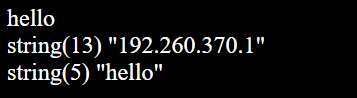

# Whiskey Tango Foxtrot (WEB) - writeup **NOT COMPLETED YET**

## Challenge description
"I let you run eval in this one. Don't tell anyone."

## Given information
We are given two pieces of information. One is a picture of a PHP-code segment and the other one is a address and a portnumber where we face the code segment. 

  
## HOWTO
### Step 1. Analysing the code
So if we take a close look at the picture we see that there are two sections that has been censured. One is what **`$a`** has been assigned to and the other one seems to be the flag. We also see that we have a input using STDIN with fgets and that our input needs to match what's inside **`$a`**. Whatever we write does also need to match the regex of **`/^[\.\*a-zA-Z\d]+$/`** - which can be simply translated to *a string of minimum length one that only contain any of the following characters dot, asterix, a to z, A to Z or digits.* One thing we may not disregard as something that we can abuse is the **eval**-function. Since it evaluates something as PHP-code. If it were not for the **preg_match** we could simply enter **`$a`** and we would have found the flag. So we need to think about how PHP process the dot and asterix since they will be the key to make the **eval**-function recognize that what we wrote was a string. There is also the fact that if we write something that matches the **preg_match**, we will get a **vardump** of both our input and the correct input. 

### Step 2. Analysing the output
So lets just start of by entering something that will match with the **preg_match** so that we can se what the correct input should be. I chose to write `hello` and got the respons

So we are supposed to find a way to write a string without ", ' and so on which contain 192.260.370.1. Since **eval** evaluates a string as a PHP-code we know that it cannot recognize an IP-address since there is no formal datatype for it. But we do know that it recognize the primal datatypes, e.g int, float and so on. We know that floats have a dot, so for us to combine digits and dots into a string we will probably have to write floats that are concatinated somehow.

### Step 3 Analysing the behaviour
In order for **eval** to recognize a string there needs to be a character involved. But we don't want any a-zA-Z in our string, so we need to find a way to remove it but in the same sense keep it long enough for **eval** to recognize it.

a\*a  
String(13) "192.260.370.1"  
Int(0)  

So by entering **a\*a** we get zero being an int. This means that **eval** interpertates **a** as a variable containing the value zero. What happens if we were to enter **a\*\*a**?

a\*\*a  
String(13) "192.260.370.1"  
Int(1)  

Although it might not be mathimatical correct to say that 0^0 = 1, it is what we get. Now let's think about what happens if we combine this with a float. Lets try and enter **a\*\*a\*192.260** and see what we get.

a\*\*a\*192.260  
String(13) "192.260.370.1"  
float(192.26)  

It is apperently considered as a float. The dot can also be used with concatinating strings in PHP so what happens if we combine what we have learned so far? So lets enter **a\*\*a\*192.260.a\*\*a\*360.1** and see what we get.

a\*\*a\*192.260.a\*\*a\*360.1  
String(13) "192.260.370.1"  
String(11) "192.26370.1"  

Almost successful! So if we think about what is happening, we realise that there are two things we need in order to be sucessful. We need one more dot and the zero in 260. So if we split the address like this 192.26, 0.36, 0.1 and concatinate them we should have the correct answer. So we end up with something like this **a\*\*a\*192.26.a\*\*a\*0.36.a\*\*a\*0.1**.

a\*\*a\*192.26.a\*\*a\*0.36.a\*\*a\*0.1  
String(13) "192.260.370.1"  
String(13) "192.260.370.1"  
Good job! Here's your flag: BTH_CTF{DON'T_REMEMBER_THE_FLAG_VALUE_SADFACE}

And there you go. Hope you liked this writeup and that it was helpful.

