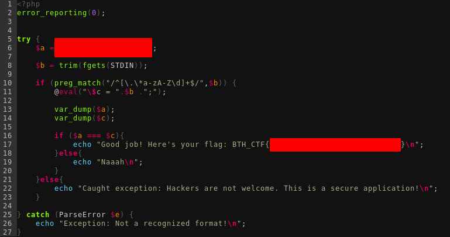

# Whiskey Tango Foxtrot - writeup

## Challenge description
"I let you run eval in this one. Don't tell anyone."

## Given information
We are given two pieces of information. One is a picture of a PHP code segment and the other one is a address and a portnumber where we face the code segment. 

  
## HOWTO
So if we take a close look at the picture we see that there are two sections that has been censured. One is what $a has been assigned to and the other one seems to be the flag. We also see that we have a input using STDIN with fgets and that our input needs to match what's inside $a. Whatever we write does also need to match the regex of /^[\.\*a-zA-Z\d]+$/ - which can be simply translated to `a string of minimum length one that only contain any of the following characters dot, asterix, a to z, A to Z and digits.`
